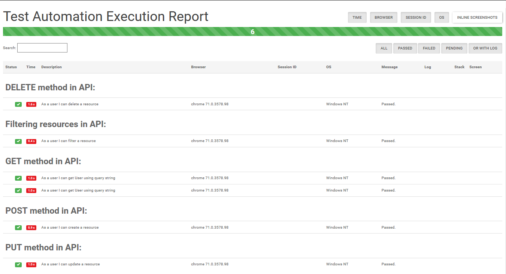
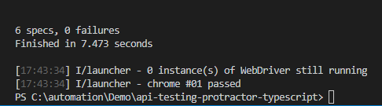

<!--  -->

# API Testing using Request node module, Protractor, Jasmine and Typescript Setup Guide
This API Test Automation framework is designed using Request node module, Protractor, Jasmine and TypeScript

## Framework Structure
```
├───images                          # This folder contains sample report image
├───temp                            # This folder contains JS file which are generated after compiling TypeScript files
├───test-results                    # This folder contains test result (includes html report and screenshots)
└───test-suites                     # This folder contains spec/test files
```

## To Get Started

### Pre-requisites
* Download and install Chrome or Firefox browser.
* Download and install Node.js:
  * [Install Node.JS](https://qaloop.tk/blog/2018/11/23/install-node-js/ "Install Node.JS")
* Optional - Download and install any Text Editor like Visual Code/Sublime/Brackets
  * [Install Visual Studio Code](https://qaloop.tk/blog/2018/11/23/install-visual-studio-code/ "Install Visual Studio Code")


### Setup Scripts 
* Clone the repository into a folder
* Go to Project root directory and install Dependency: `npm install`
* All the dependencies from package.json and ambient typings would be installed in node_modules folder.

### How to write Test
* Add new spec under test-suite folder
* Name the file as <testname>.spec.ts (e.g. get-user.spec.ts)

### How to Run Test
* Run complete Test Suite: `npm test`

### How to Update local npm packages
* Go to Project root directory and run command: `npm update`

### Sample Test Results
<p align="center">

</p>

<p align="center">

</p>


## [Step by Step installation instruction for Beginners](https://qaloop.tk/blog/2018/12/20/rest-api-automation-using-request-npm-protractor-jasmine-and-typescript  "Step by Step installation instruction for Beginners")


## Visit my [Blog](https://qaloop.tk/blog/ "Blog")

## Reference
* https://www.npmjs.com/package/request

* https://jsonplaceholder.typicode.com/
* https://github.com/typicode/jsonplaceholder

* https://github.com/toddmotto/public-apis
* https://github.com/davemachado/public-api
